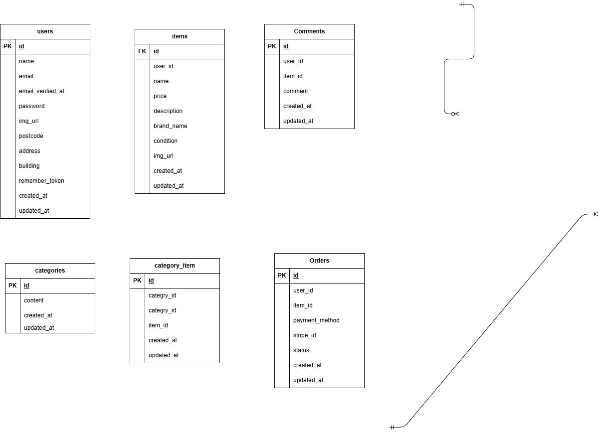

## アプリケーション名

coachtechフリマ

## 環境構築

1⃣　Dockerビルド

① アプリケーションを作成するために、開発環境を GitHub からクローンします。

```
コマンドライン上

git clone git@github.com:HIDE52/hide-fremaapp.git
mv hide-fremaapp coachtechフリマ
```

② 開発環境を構築します。

```
コマンドライン上

cd coachtechフリマ
docker-compose up -d --build
code .
```

③「Docker Desktop 」の確認を行い、「coachtechフリマ」コンテナが作成されているか確認を行います。

2⃣　Laravelの初期設定

① Dockerコンテナ内に移動します。

```
コマンドライン上

docker-compose exec php bash
```

② 必要なパッケージをインストールします。

```
PHPコンテナ上

composer install
```

③ 設定ファイル（.env）を作成し、データベースの接続先を書き換えます。

```
PHPコンテナ上

cp .env.example .env
```

.env ファイルを開き、以下の項目をdocker-compose.yml の設定に合わせて 書き換えて保存してください

```
.envファイル

DB_CONNECTION=mysql
DB_HOST=mysql
DB_PORT=3306
DB_DATABASE=laravel_db
DB_USERNAME=laravel_user
DB_PASSWORD=laravel_pass
```

④ セキュリティに必要な「鍵」を作ります。

```
PHPコンテナ上

php artisan key:generate
```

⑤ 画像を表示させるために実行します。

```
PHPコンテナ上

php artisan storage:link
```


3⃣ データベースの構築

⑥ データベースにテーブルを作成します。

```
PHPコンテナ上

php artisan migrate
```

⑦ 初期データ（テストデータ）を登録します。

```
PHPコンテナ上

php artisan db:seed
```


4⃣ テスト環境の構築

本アプリケーションでは PHPUnit を使用して自動テストを実施しています。
テストを実行する前に、以下の手順でテスト用データベースの準備を行ってください。

⓵ テスト用データベースの作成

1.MySQコンテナ内に移動します。

  ```
  コマンドライン上

  docker-compose exec mysql bash
  ```

･新規でデータベースを作成する際は、権限の問題でrootユーザ（管理者)でログインす る必要があります。

```
MySQL上コンテナ上

mysql -u root -p
```
･パスワードは、docker-compose.ymlファイルのMYSQL_ROOT_PASSWORD:に設定されているrootを入力します。


･MySQLログイン後、demo_testの作成を行います。

```
MySQL上コンテナ上

CREATE DATABASE demo_test;
SHOW DATABASES;
```

② テスト環境の設定

･configディレクトリの中のdatabase.phpを開き、以下を参考に変更をしてください。

```
database.php

'mysql' => [
// 中略
],

+ 'mysql_test' => [
+             'driver' => 'mysql',
+             'url' => env('DATABASE_URL'),
+             'host' => env('DB_HOST', '127.0.0.1'),
+             'port' => env('DB_PORT', '3306'),
+             'database' => 'demo_test',
+             'username' => 'root',
+             'password' => 'root',
+             'unix_socket' => env('DB_SOCKET', ''),
+             'charset' => 'utf8mb4',
+             'collation' => 'utf8mb4_unicode_ci',
+             'prefix' => '',
+             'prefix_indexes' => true,
+             'strict' => true,
+             'engine' => null,
+             'options' => extension_loaded('pdo_mysql') ? array_filter([
+                 PDO::MYSQL_ATTR_SSL_CA => env('MYSQL_ATTR_SSL_CA'),
+             ]) : [],
+ ],
```

③テスト用の.envファイル作成

･PHPコンテナにログインし、.envをコピーして.env.testingを作成します。

```
PHPコンテナ上

cp .env .env.testing
```

･ファイルの作成ができたたら、.env.testingファイルの文頭部分にあるAPP_ENVとAPP_KEYを編集します。

```
.env.testing

APP_NAME=Laravel
- APP_ENV=local
- APP_KEY=base64:vPtYQu63T1fmcyeBgEPd0fJ+jvmnzjYMaUf7d5iuB+c=
+ APP_ENV=test
+ APP_KEY=
APP_DEBUG=true
APP_URL=http://localhost
```

･.env.testingにデータベースの接続情報を加えます。

```
.env.testing

  DB_CONNECTION=mysql_test
  DB_HOST=mysql
  DB_PORT=3306
- DB_DATABASE=laravel_db
- DB_USERNAME=laravel_user
- DB_PASSWORD=laravel_pass
+ DB_DATABASE=demo_test
+ DB_USERNAME=root
+ DB_PASSWORD=root
```

･APP_KEYに新たなテスト用のアプリケーションキーを加えるます。

```
PHPコンテナ上

php artisan key:generate --env=testing
```

･キャッシュの削除を行い、反映をしやすいようにします。

```
PHPコンテナ上

php artisan config:clear
```

･マイグレーションコマンドを実行して、テスト用のテーブルを作成します。

```
PHPコンテナ上

php artisan migrate --env=testing
```


5⃣テストコマンドの実施準備
④phpunitの編集

･テスト用のデータベースで、テストを実行するには、phpunit.xmlの編集を行います。

```
phpunit.xml

    <php>
        <server name="APP_ENV" value="testing"/>
        <server name="BCRYPT_ROUNDS" value="4"/>
        <server name="CACHE_DRIVER" value="array"/>
-         <!-- <server name="DB_CONNECTION" value="sqlite"/> -->
-         <!-- <server name="DB_DATABASE" value=":memory:"/> -->
+         <server name="DB_CONNECTION" value="mysql_test"/>
+         <server name="DB_DATABASE" value="demo_test"/>
        <server name="MAIL_MAILER" value="array"/>
        <server name="QUEUE_CONNECTION" value="sync"/>
        <server name="SESSION_DRIVER" value="array"/>
        <server name="TELESCOPE_ENABLED" value="false"/>
    </php>
```

･テスト用のデータベースでテストのコマンドを実施します。

```
PHPコンテナ上

php artisan test
```


## 使用技術(実行環境)

- PHP 8.1.34
- Laravel 8.83.8
- MySQL 8.0.26
- Nginx 1.21.1

## URL

商品一覧トップ画面：http://localhost/<br/>
ユーザー登録：http://localhost/register<br/>
ログイン：http://localhost/login<br/>
phpMyAdmin (DB確認ツール)：http://localhost:8080/<br/>
メール確認 (Mailhog):http://localhost:8025/<br/>

## ER図


